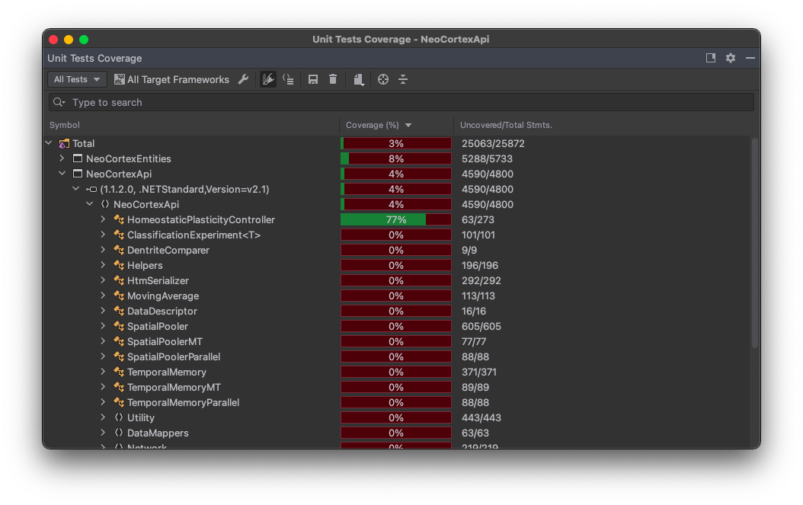

| Project Topic  | ML21/22 28.Improve UnitTests: HomeostaticPlasticityController |
| :------------ | :------------ |
| Project Team Name  | Team1  |
| Team Members  | [Shubham Suryawanshi](https://github.com/shubhamsuryawanshi)  |
| Project Commits  | [Link](https://github.com/shubhamsuryawanshi/neocortexapi/commits/shubham?author=shubhamsuryawanshi)  |
| Project Repository  | [Link](https://github.com/shubhamsuryawanshi/neocortexapi/tree/shubham)  |
| Classroom Repository  | [Link](https://github.com/UniversityOfAppliedSciencesFrankfurt/se-cloud-2021-2022/tree/Team1)  |

As part of this project new Unit Tests were designed for HomeostaticPlasticityController class.
There were no tests previously implemented for the class. [This](https://github.com/shubhamsuryawanshi/neocortexapi/blob/shubham/source/UnitTestsProject/HomeostaticPlasticityControllerTests.cs) file was created in the existing project 'UnitTestsProject' of the [Neocortex](https://github.com/ddobric/neocortexapi) API.

Following image is the Unit Test Run Result of these new HomeostaticPlasticityController Unit Tests. 
  

Following image is the Code Coverage Report for the HomeostaticPlasticityController Unit Tests.

