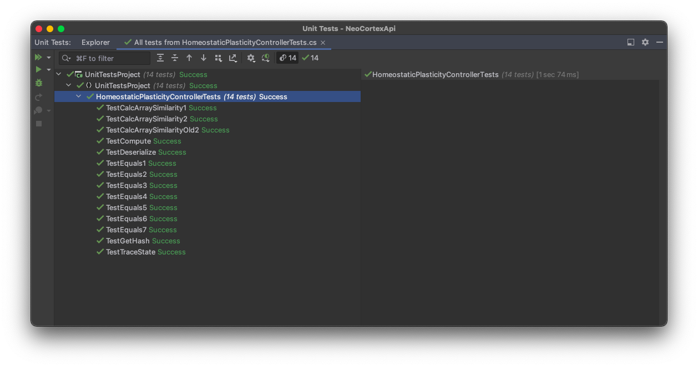
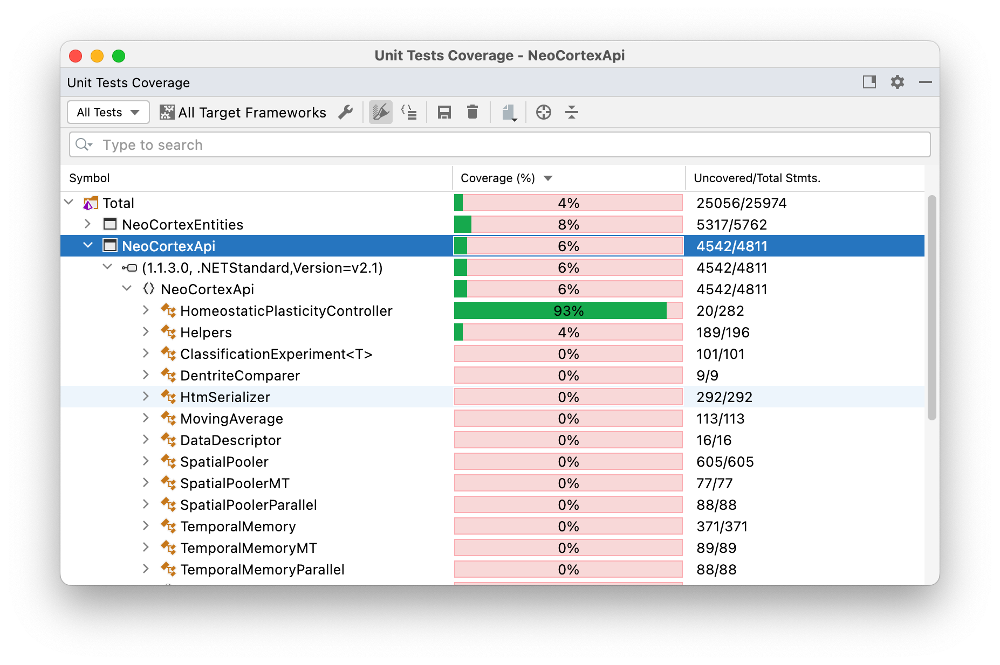

| Project Topic  | ML21/22 28.Improve UnitTests: HomeostaticPlasticityController |
| :------------ | :------------ |
| Project Team Name  | Team1  |
| Team Members  | [Shubham Suryawanshi](https://github.com/shubhamsuryawanshi)  |
| Project Commits  | [Link](https://github.com/shubhamsuryawanshi/neocortexapi/commits/shubham?author=shubhamsuryawanshi)  |
| Project Repository  | [Link](https://github.com/shubhamsuryawanshi/neocortexapi/tree/shubham)  |
| Classroom Repository  | [Link](https://github.com/UniversityOfAppliedSciencesFrankfurt/se-cloud-2021-2022/tree/Team1)  |
| MySEProject directory  | [Link](https://github.com/UniversityOfAppliedSciencesFrankfurt/se-cloud-2021-2022/tree/Team1/Source/MySEProject)  |

Homeostatic Plasticity Controller (HPC) plays a vital role as an extension of Hierarchical Temporal Memory (HTM) – Spatial Pooler (SP) learning algorithm. HPC and SP have been modelled and implemented as part of the .NET Core Library: NeoCortex API. The HPC class is designed to work in tandem with the SP algorithm. By controlling the boosting and inhibition mechanism during Spare Distributed Representation (SDR) generation process, the HPC is fundamentally important to the HTM SP algorithm. To make sure methods in the modelled HPC class are operating accurately, rigorous Unit Tests have been designed and implemented in the project UnitTestsProject of the NeoCortex API.

As part of this project new Unit Tests were designed for HomeostaticPlasticityController class.
There were no tests previously implemented for the class. A new Unit Test Class [HomeostaticPlasticityControllerTests](https://github.com/shubhamsuryawanshi/neocortexapi/blob/shubham/source/UnitTestsProject/HomeostaticPlasticityControllerTests.cs) was created in the existing project 'UnitTestsProject' of the [Neocortex](https://github.com/ddobric/neocortexapi) API. Please refer to the [Project Report](https://github.com/shubhamsuryawanshi/neocortexapi/blob/shubham/source/MySEProject/Documentation/Report.docx) for a detailed walkthrough of every Unit Test designed and implemented in this Unit Test Class.

Following image is the Unit Test Run Result of these new HomeostaticPlasticityControllerTests Unit Test Class. 

  

Following image is the Code Coverage Report generated after running all the Unit Tests for the HomeostaticPlasticityController.

